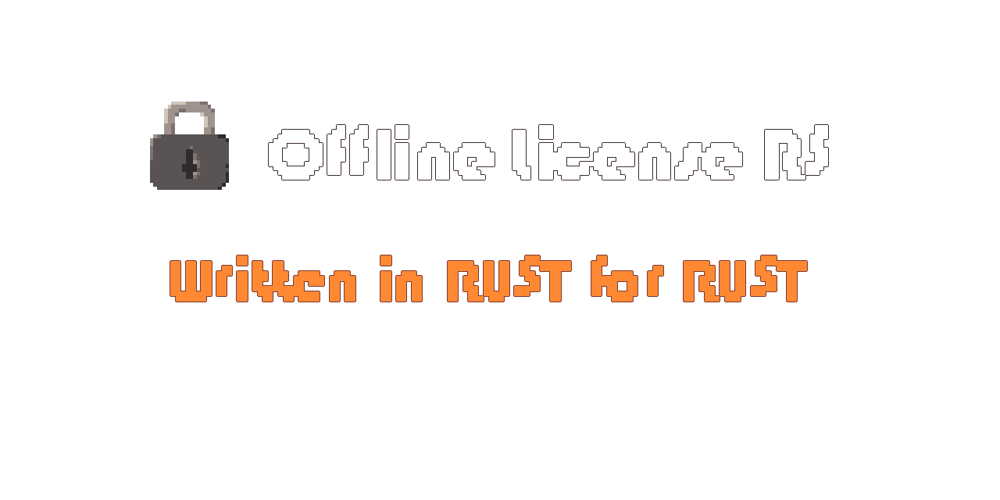

---

Be patient, this is still WIP

(づ｡◕‿‿◕｡)づ

---

**Offline license RS** is mainly inspired by [license-key](https://github.com/patriksvensson/license-key) rust library 
and [Implementing a Partial Serial Number Verification System in Delphi](https://www.brandonstaggs.com/2007/07/26/implementing-a-partial-serial-number-verification-system-in-delphi/)
blog.

**Offline license RS** is able to generate license key for your product without validating
it with network connection. It is also important to say that this method will not 
prevent **Cracking** or **Unauthorized distributing** of your software also known as `PIRACY`.

## Table of contents

- [Example](#example)
- [Q&A](#q-a)

## Example

TODO

## Q&A

- Why did you create this library when already exist similar libraries written in **RUST** for example
[license-key](https://github.com/patriksvensson/license-key).

> I want to learn RUST.

- Why use offline license validation when it is described as "unsafe" and possible "crackable" license generator.

> To make easier life for our consumer, whenever they will not have access to internet. Anyway
> license key can be validated again whenever user will have access to the internet, e.g. with
> license key server. Also have on mind that your license server for online license key
> verification can any time die and user will not be able to activate your product/software
> again. There will be always a way to crack your product/software...
